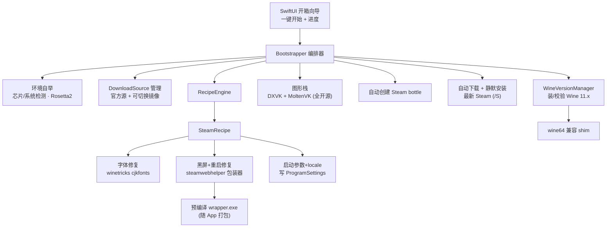

# NeatWhisky · Steam 一键适配 Fork（开源项目计划）

## 项目定位

**NeatWhisky** —— Fork 归档的 [Whisky-App/Whisky](https://github.com/Whisky-App/Whisky)（GPL-3.0，SwiftUI）。命名取自威士忌「neat（纯饮）」的双关：既延续 Whisky 酒类意象，又点明「把乱码/黑屏这些脏乱修干净」的核心价值。差异化价值：**Whisky 作者明确拒绝做的「应用级修复」**——尤其 Steam。已有 fork Brandywine 只升级底层 Wine，NeatWhisky 在此之上做「**小白开箱一键：从零到能玩** + 可扩展修复配方」。

## 目标体验（小白视角）

下载 NeatWhisky.app → 拖入「应用程序」→ 打开 → 点「一键开始」→ 看进度条 →（自动完成：Rosetta、Wine、图形库、bottle、下载安装最新 Steam、套用修复）→ Steam 正常打开、中文正常、不黑屏、能正常关闭。全程**不需要任何命令行、不需要懂 Wine**。

## 整体架构

## 关键技术锚点（来自 Whisky 源码）

- `WhiskyKit/Sources/WhiskyKit/Wine/Wine.swift`：`wineBinary = WhiskyWineInstaller.binFolder.appending(path: "wine64")` —— **硬编码 `wine64`**，Wine 11 (WoW64) 只有 `wine`，fork 必须改造或建 shim。
- `Wine.swift` 已有 `runWineProcess(args:bottle:)` / `runProgram(at:args:bottle:)` / `runWineserverProcess` —— 修复配方直接复用这些接口跑 winetricks、wineboot、文件操作。
- `WhiskyWineInstaller` + `WhiskyWineVersion.plist`：Wine 下载与版本记录逻辑，需改为指向现代 Wine 11.x 构建并阻止降级。
- `Programs/ProgramSettings`（bottle 内 `Program Settings/Steam.exe.plist`）：`arguments` / `locale` 字段，配方写入启动参数。

## 实施里程碑

> 实现状态（2026-06）：M1–M13 的代码均已落地（见 `NOTICE.md` 改动清单与 `WhiskyKit` 测试）。
> Wine 11.x 构建产物已托管于 GitHub Releases `v11.10.0`，仓库已公开，官方 + 国内镜像
> （gh-proxy.com / ghfast.top）匿名下载链路已实测可达。
> **分发**：当前主路径为 Homebrew Cask（自有 tap，cask 内 postflight 自动去隔离，见顶部
> `ops-brew-tap`）；Apple Developer ID 签名 + 公证推迟到项目成熟后启用（见 `ops-sign-notarize`，deferred）。
> 以下里程碑保留作为设计说明。

### M1 项目脚手架与 GPL 合规
- Fork v2.3.5，改名为 NeatWhisky、改 Bundle ID（如 `app.neatwhisky`）、保留原 LICENSE 与版权头、README 注明衍生自 Whisky 与改动点（GPL-3.0 要求）。
- 配置 GitHub Actions：macOS runner 编译 Swift app + 用 `mingw-w64` 交叉编译 wrapper.exe，产物打包进 `.app`。

### M2 Wine 版本适配（替换 7.7 → Staging 11.x）
- 改 `WhiskyWineInstaller` 的下载源指向现代 Wine Staging 11.x（如 Gcenx 构建），更新版本校验逻辑防止降级回 7.7。
- 解决 `wine64` 问题：在 `Wine.swift` 把 `wineBinary` 改为优先 `wine`、回退 `wine64`；或安装后自动建 `wine64 -> wine` 符号链接。
- 安装/升级既有 bottle 时自动跑 `wineboot -u`。

### M3 全开源图形栈（Wine + DXVK + MoltenVK）
- 随 App 打包 DXVK（D3D→Vulkan），Wine 11 构建已自带 MoltenVK（Vulkan→Metal，本机日志已验证）。
- **显式不含 GPTK / CrossOver 组件**，规避再分发法律风险（这正是 Whisky 被指「寄生」的点）。
- 创建 bottle 时启用 DXVK；重度 3A 性能弱于 GPTK，文档明确说明取舍。

### M4 Recipe 引擎（可扩展配方框架）
- WhiskyKit 新增 `Recipes/` 模块：`protocol AppRecipe { var id; func detect(bottle); func apply(bottle); func repair(bottle); func status(bottle) }`。
- 提供通用工具：`installWinetricksVerb()`、`patchRegistry()`、`installFileIntoBottle()`、`setProgramArguments()` —— 复用 `Wine.runWineProcess`。
- 配方可声明「需要的 Wine 最低版本」，引擎按需触发 M2。

### M5 SteamRecipe · 乱码修复
- 检测 bottle 内 Steam，缺中文字体时执行 `winetricks cjkfonts`（参考本机已验证流程），写入 FontLink。

### M6 SteamRecipe · 黑屏 + 关闭重启修复（核心）
- **预编译并随 App 打包** `steamwebhelper_wrapper.exe`（带 Job Object `KILL_ON_JOB_CLOSE` + 强制 `--disable-gpu --single-process`，源码见本机 `~/.steam-wine-fix/steamwebhelper_wrapper.c`），用户无需装编译器。
- apply：备份 `steamwebhelper.exe → steamwebhelper_orig.exe`，把 wrapper 拷入 `bin/cef/cef.win64` 与 `cef.win7x64`。
- Job Object 同时解决「关闭后子进程残留→反复重启」。

### M7 SteamRecipe · 启动参数与 locale
- 写入 `arguments = -cef-disable-gpu -cef-disable-gpu-compositing -noverifyfiles`（`-noverifyfiles` 防 Steam 还原 wrapper），必要时设 `locale`。

### M8 小白开箱自举（Bootstrapper · 一键核心）
- **环境检测**：Apple Silicon / macOS 版本门槛校验；缺 Rosetta 2 时自动 `softwareupdate --install-rosetta --agree-to-license`。
- **自动建 bottle**：创建专用 Steam bottle（Win10、区域/字体预设），自动套用 M2/M3。
- **自动装 Steam**：从官方 CDN 拉取最新 `SteamSetup.exe`，`wine SteamSetup.exe /S` 静默安装。
- **一条龙编排**：把「Rosetta→Wine→图形栈→bottle→下载Steam→装Steam→套用SteamRecipe→首次启动」串成单流程，**任一步失败可重试/回滚**，全程进度可视。

### M9 下载源管理（官方 + 可切换镜像）
- 把 Wine 构建、Steam 安装包、winetricks 字体等下载项抽象为 `DownloadSource`，默认官方源、可切换镜像（兼顾中国大陆与海外）。
- 支持手动选源与失败自动换源；可填自定义镜像/代理。

### M10 GUI 集成（开箱向导）
- 首启「开箱向导」：一键开始 → 实时进度（每阶段状态）→ 完成即玩。
- bottle 详情页保留「一键适配 / 重新修复」入口与状态展示（已修复/需修复/已失效）。

### M11 自愈与维护
- 「重新应用修复」入口（对应本机 `reapply-wrapper.sh`）：Steam 大更新覆盖 wrapper 后一键恢复。
- 启动 Steam 前自动校验 wrapper 是否被还原，被还原则自动重装。

### M12 分发
- **当前：Homebrew Cask（自有 tap）**——`brew install --cask shawnsayno/tap/neatwhisky`。cask 内置 `postflight` 自动剥离 `com.apple.quarantine`，安装即可启动，既绕过 Homebrew 对未签名 cask 的隔离，也规避正在被 Homebrew 废弃的 `--no-quarantine`。面向已使用 Homebrew 的用户。
- **成熟后：Developer ID 签名 + 公证**——产出可双击的 DMG，让完全不碰命令行的小白也能用；需付费 Apple 开发者账号（见顶部 `ops-sign-notarize`，已 deferred）。
- GitHub Releases 出 DMG（未签名版同时作为 cask 来源）；CI 自动出包 + 自动 bump cask。

### M13 文档（中英双语，价值导向）
- README 以**项目价值**为主线，而非技术实现：核心叙事就是「**小白从零到能玩，全程一键**（Zero to playing, one click — no terminal, no Wine knowledge）」。
- 结构建议：一句话价值主张 → 痛点（Whisky 已停更、Steam 乱码/黑屏/闪退）→ NeatWhisky 的解法（一键、自动备齐依赖、自动装最新 Steam、自动修复）→ 截图/GIF 演示「点一下到进游戏」→ 安装入口。
- **中英双语**：提供 `README.md`（English）与 `README.zh-CN.md`（简体中文），顶部互链。
- 技术实现（Wine 升级、wrapper 原理、字体修复等）**降级为次级文档**：单独的 `docs/how-it-works`（可复用本机 `~/Desktop/Whisky-Steam-适配文档.html` 内容），README 仅以一句话 + 链接带过，不喧宾夺主。

## 风险与注意

- **GPL-3.0**：fork 与衍生必须同样 GPL-3.0 开源、保留署名、声明改动。
- **图形栈法律边界**：默认全开源（Wine/DXVK/MoltenVK 均可再分发）；**坚决不打包 GPTK/CrossOver 二进制**。重度 3A 性能因此弱于 CrossOver，需在文档诚实说明。
- **签名公证是「一键」的前提**：未公证的 App 小白打不开。需 Apple Developer 账号（99 美元/年）。
- **下载稳定性**：官方源在中国大陆可能慢/不可达，镜像与换源机制是「小白一键」体验的关键，否则会卡在下载。
- **Rosetta/系统门槛**：仅支持 Apple Silicon + 满足最低 macOS；旧机型需给出明确提示而非静默失败。
- **兼容性时效**：Wine 11 + CEF 126 的修复对未来 Steam/Wine 版本不保证长期有效，配方需可快速迭代 + 自愈兜底。
- **不重复造轮子**：Wine 升级部分可评估借鉴 Brandywine 成果，聚焦自身的 Bootstrapper + Recipe 引擎 + Steam 修复。